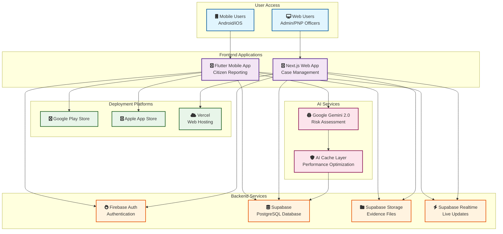
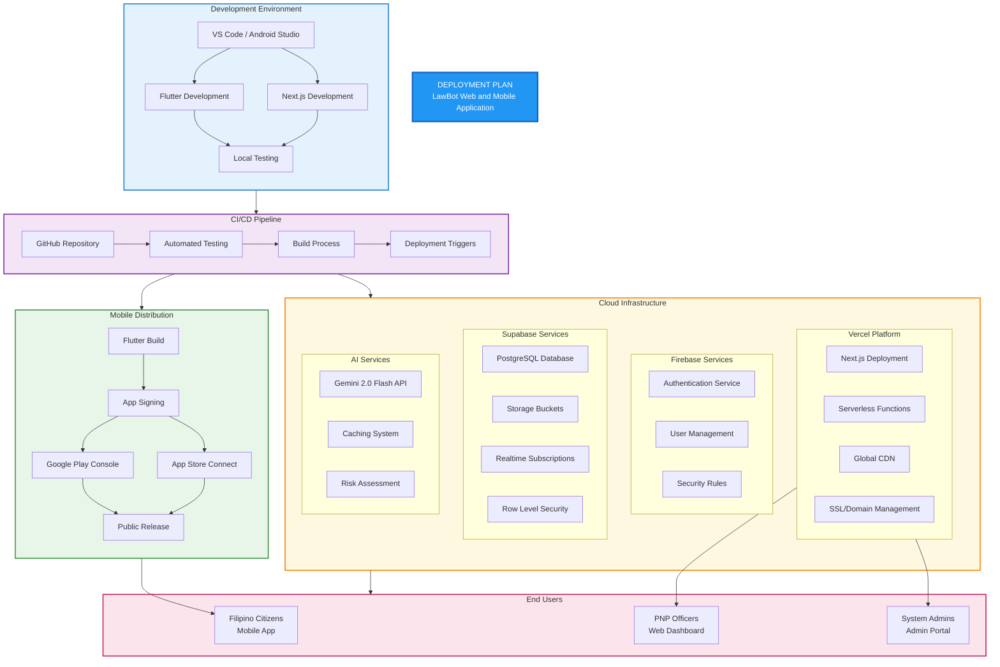
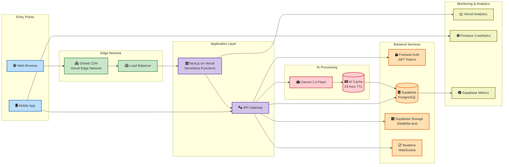
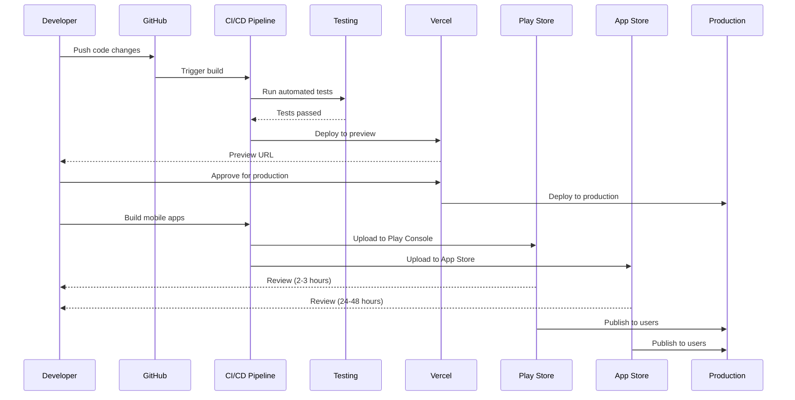

# LawBot Platform - Deployment Plan

## Executive Summary

This deployment plan outlines the comprehensive strategy for deploying the LawBot AI-Powered Cybercrime Reporting Platform, consisting of a Flutter mobile application and Next.js web application. The platform will be deployed using modern cloud infrastructure with Firebase, Supabase, Vercel, and mobile app stores.

## Table of Contents

1. [System Architecture Overview](#system-architecture-overview)
2. [Infrastructure Components](#infrastructure-components)
3. [Deployment Environments](#deployment-environments)
4. [Mobile Application Deployment](#mobile-application-deployment)
5. [Web Application Deployment](#web-application-deployment)
6. [Backend Services Deployment](#backend-services-deployment)
7. [Security Considerations](#security-considerations)
8. [Monitoring and Maintenance](#monitoring-and-maintenance)
9. [Cost Estimation](#cost-estimation)
10. [Deployment Timeline](#deployment-timeline)

## System Architecture Overview

### High-Level Architecture



### Detailed Deployment Architecture



### Infrastructure Flow Diagram



### Deployment Process Flow



### Technology Stack

#### Mobile Application (Flutter)
- **Framework**: Flutter 3.0+
- **Language**: Dart
- **State Management**: Provider
- **Target Platforms**: Android 5.0+ (API 21), iOS 12.0+

#### Web Application (Next.js)
- **Framework**: Next.js 15.4.4
- **Language**: TypeScript
- **Styling**: Tailwind CSS
- **Deployment**: Vercel

#### Backend Services
- **Authentication**: Firebase Auth
- **Database**: Supabase (PostgreSQL)
- **AI Services**: Google Gemini 2.0 Flash
- **File Storage**: Supabase Storage
- **Real-time**: Supabase Realtime

## Infrastructure Components

### 1. Firebase Services
- **Authentication**: Multi-platform user authentication
- **Configuration**:
  - Project ID: lawbot-production
  - Region: asia-southeast1 (Singapore)
  - Authentication Methods: Email/Password

### 2. Supabase Services
- **Database**: PostgreSQL with 15+ tables
- **Storage**: Evidence file storage (25MB limit per upload)
- **Real-time**: WebSocket connections for live updates
- **Configuration**:
  - Region: Southeast Asia (Singapore)
  - Database: 2 vCPUs, 4GB RAM
  - Storage: 100GB initial capacity

### 3. Vercel Deployment (Web App)
- **Framework**: Next.js optimized deployment
- **Features**:
  - Automatic HTTPS
  - Global CDN
  - Serverless functions
  - Preview deployments

### 4. AI Services (Google Gemini)
- **Model**: Gemini 2.0 Flash
- **Features**:
  - Risk assessment
  - Evidence guidance
  - Pattern detection
  - Credibility scoring
- **Caching**: 24-hour cache for cost optimization

## Deployment Environments

### Development Environment
- **Mobile**: Local development with Flutter DevTools
- **Web**: Local Next.js development server
- **Database**: Supabase development project
- **Authentication**: Firebase development project

### Staging Environment
- **Mobile**: Internal testing builds
- **Web**: Vercel preview deployments
- **Database**: Supabase staging project
- **Authentication**: Firebase staging project

### Production Environment
- **Mobile**: App Store/Play Store releases
- **Web**: Vercel production deployment
- **Database**: Supabase production project
- **Authentication**: Firebase production project

## Mobile Application Deployment

### Android Deployment (Google Play Store)

#### Pre-deployment Requirements
1. **Google Play Console Account**
   - Developer registration ($25 one-time fee)
   - Merchant account for paid features

2. **App Configuration**
   ```yaml
   # pubspec.yaml
   version: 1.0.0+1
   ```

3. **Build Configuration**
   ```bash
   # Generate signing key
   keytool -genkey -v -keystore lawbot-release.keystore -keyalg RSA -keysize 2048 -validity 10000 -alias lawbot
   
   # Configure key.properties
   storePassword=<password>
   keyPassword=<password>
   keyAlias=lawbot
   storeFile=../lawbot-release.keystore
   ```

#### Build Process
```bash
# Clean build
flutter clean

# Get dependencies
flutter pub get

# Build APK
flutter build apk --release

# Build App Bundle (recommended)
flutter build appbundle --release
```

#### Deployment Steps
1. Upload to Google Play Console
2. Fill app information (title, description, screenshots)
3. Set content rating
4. Configure pricing and distribution
5. Submit for review (2-3 hours typical)

### iOS Deployment (Apple App Store)

#### Pre-deployment Requirements
1. **Apple Developer Account**
   - $99/year membership
   - App Store Connect access

2. **Certificates and Provisioning**
   - Development certificate
   - Distribution certificate
   - App ID
   - Provisioning profiles

3. **Xcode Configuration**
   ```
   Bundle Identifier: com.lawbot.app
   Version: 1.0.0
   Build: 1
   ```

#### Build Process
```bash
# Clean build
flutter clean

# Get dependencies
flutter pub get

# Build iOS
flutter build ios --release

# Open in Xcode
open ios/Runner.xcworkspace
```

#### Deployment Steps
1. Archive in Xcode
2. Upload to App Store Connect
3. Fill app metadata
4. Submit for review (24-48 hours typical)

## Web Application Deployment

### Vercel Deployment Configuration

#### 1. Project Setup
```json
// vercel.json
{
  "framework": "nextjs",
  "buildCommand": "npm run build",
  "outputDirectory": ".next",
  "devCommand": "npm run dev",
  "installCommand": "npm install",
  "regions": ["sin1"],
  "functions": {
    "src/app/api/**/*.ts": {
      "maxDuration": 30
    }
  }
}
```

#### 2. Environment Variables
```bash
# .env.production
NEXT_PUBLIC_FIREBASE_API_KEY=
NEXT_PUBLIC_FIREBASE_AUTH_DOMAIN=
NEXT_PUBLIC_FIREBASE_PROJECT_ID=
NEXT_PUBLIC_SUPABASE_URL=
NEXT_PUBLIC_SUPABASE_ANON_KEY=
SUPABASE_SERVICE_ROLE_KEY=
```

#### 3. Deployment Process

##### GitHub Integration
```bash
# Connect repository to Vercel
vercel link

# Configure production branch
vercel git connect

# Set environment variables
vercel env add NEXT_PUBLIC_FIREBASE_API_KEY production
```

##### Manual Deployment
```bash
# Install Vercel CLI
npm i -g vercel

# Login
vercel login

# Deploy to production
vercel --prod
```

### Domain Configuration
```
# Production domains
lawbot.ph
www.lawbot.ph
admin.lawbot.ph

# SSL: Automatic via Vercel
# CDN: Global edge network
```

## Backend Services Deployment

### Firebase Configuration

#### 1. Authentication Setup
```javascript
// firebase.json
{
  "auth": {
    "enabled": true,
    "providers": {
      "email": true
    }
  }
}
```

#### 2. Security Rules
```javascript
// Firebase Auth Security
{
  "rules": {
    "users": {
      "$uid": {
        ".read": "$uid === auth.uid",
        ".write": "$uid === auth.uid"
      }
    }
  }
}
```

### Supabase Configuration

#### 1. Database Schema Deployment
```bash
# Run migration scripts
psql $DATABASE_URL < CURRENT_DATABASE_SCHEMA.sql

# Verify tables
SELECT table_name FROM information_schema.tables 
WHERE table_schema = 'public';
```

#### 2. Row Level Security (RLS)
```sql
-- Enable RLS on all tables
ALTER TABLE complaints ENABLE ROW LEVEL SECURITY;
ALTER TABLE user_profiles ENABLE ROW LEVEL SECURITY;
ALTER TABLE notifications ENABLE ROW LEVEL SECURITY;

-- Create policies
CREATE POLICY "Users can view own complaints" ON complaints
  FOR SELECT USING (auth.uid() = user_id);
```

#### 3. Storage Configuration
```sql
-- Create evidence bucket
INSERT INTO storage.buckets (id, name, public)
VALUES ('evidence-files', 'evidence-files', true);

-- Set upload policies
CREATE POLICY "Authenticated users can upload evidence"
ON storage.objects FOR INSERT
WITH CHECK (bucket_id = 'evidence-files' AND auth.role() = 'authenticated');
```

### AI Services Setup

#### Gemini API Configuration
```dart
// lib/config/gemini_config.dart
class GeminiConfig {
  static const String apiKey = String.fromEnvironment('GEMINI_API_KEY');
  static const String model = 'gemini-2.0-flash';
  static const int maxTokens = 8192;
}
```

## Security Considerations

### 1. API Key Management
- **Development**: Use `.env` files (git-ignored)
- **Production**: Use platform secret management
  - Vercel: Environment variables
  - Mobile: Obfuscation + certificate pinning

### 2. Data Protection
- **Encryption**: TLS 1.3 for all connections
- **Authentication**: Firebase JWT tokens
- **Authorization**: Supabase RLS policies
- **File Security**: Signed URLs for evidence files

### 3. Security Headers (Web)
```javascript
// next.config.js
const securityHeaders = [
  {
    key: 'X-DNS-Prefetch-Control',
    value: 'on'
  },
  {
    key: 'X-XSS-Protection',
    value: '1; mode=block'
  },
  {
    key: 'X-Frame-Options',
    value: 'SAMEORIGIN'
  },
  {
    key: 'X-Content-Type-Options',
    value: 'nosniff'
  },
  {
    key: 'Referrer-Policy',
    value: 'origin-when-cross-origin'
  }
];
```

### 4. Compliance
- **Data Privacy**: NDPA (National Data Privacy Act) compliance
- **Data Retention**: 5-year retention for legal requirements
- **Access Logs**: Audit trail for all data access

## Monitoring and Maintenance

### 1. Application Monitoring

#### Vercel Analytics (Web)
```javascript
// Enable Web Analytics
import { Analytics } from '@vercel/analytics/react';

export default function RootLayout({ children }) {
  return (
    <html>
      <body>
        {children}
        <Analytics />
      </body>
    </html>
  );
}
```

#### Firebase Crashlytics (Mobile)
```dart
// Initialize Crashlytics
await FirebaseCrashlytics.instance.setCrashlyticsCollectionEnabled(true);
FlutterError.onError = FirebaseCrashlytics.instance.recordFlutterError;
```

### 2. Database Monitoring
- **Supabase Dashboard**: Real-time metrics
- **Query Performance**: pg_stat_statements
- **Connection Pooling**: Monitor active connections

### 3. AI Service Monitoring
- **Usage Tracking**: Monitor API calls and costs
- **Cache Hit Rate**: Track cache effectiveness
- **Response Times**: Monitor AI service latency

### 4. Uptime Monitoring
- **Services**: UptimeRobot or Pingdom
- **Endpoints**:
  - Web app: https://lawbot.ph/api/health
  - Mobile API: https://api.lawbot.ph/health
  - Database: Connection pool monitoring

## Cost Estimation

### Monthly Cost Breakdown

#### 1. Firebase
- **Authentication**: Free tier (50K monthly active users)
- **Estimated**: $0/month

#### 2. Supabase
- **Pro Plan**: $25/month
  - 8GB database
  - 100GB storage
  - 50GB bandwidth
- **Scaling**: +$10 per additional 8GB database

#### 3. Vercel
- **Pro Plan**: $20/month per member
- **Bandwidth**: 1TB included
- **Functions**: 1000 hours included
- **Estimated**: $20-100/month

#### 4. Google Gemini API
- **Pricing**: $0.00025 per 1K characters
- **With Caching**: ~90% reduction
- **Estimated**: $50-200/month (based on usage)

#### 5. App Stores
- **Google Play**: $25 (one-time)
- **Apple App Store**: $99/year

#### Total Estimated Monthly Cost
- **Minimum**: $95/month
- **Typical**: $200-300/month
- **High Usage**: $500+/month

## Deployment Timeline

### Phase 1: Infrastructure Setup (Week 1)
- [ ] Firebase project creation and configuration
- [ ] Supabase project setup and schema deployment
- [ ] Vercel account and project setup
- [ ] Domain registration and DNS configuration

### Phase 2: Backend Deployment (Week 2)
- [ ] Database schema migration
- [ ] Authentication configuration
- [ ] Storage bucket setup
- [ ] API endpoint testing

### Phase 3: Web Application Deployment (Week 3)
- [ ] Vercel GitHub integration
- [ ] Environment variable configuration
- [ ] Initial deployment
- [ ] Domain mapping and SSL

### Phase 4: Mobile App Preparation (Week 4)
- [ ] App store account setup
- [ ] Certificates and provisioning
- [ ] Build configuration
- [ ] Internal testing

### Phase 5: Mobile App Deployment (Week 5-6)
- [ ] Google Play Store submission
- [ ] Apple App Store submission
- [ ] Review process monitoring
- [ ] Post-launch monitoring

### Phase 6: Production Launch (Week 7)
- [ ] Monitoring setup
- [ ] Performance optimization
- [ ] User documentation
- [ ] Support system activation

## Post-Deployment Checklist

### Immediate (Day 1)
- [ ] Verify all services are running
- [ ] Test authentication flows
- [ ] Confirm database connectivity
- [ ] Check AI service integration
- [ ] Monitor error logs

### Week 1
- [ ] Performance baseline establishment
- [ ] User feedback collection
- [ ] Bug tracking and fixes
- [ ] Cost monitoring

### Month 1
- [ ] Performance optimization
- [ ] Security audit
- [ ] Backup verification
- [ ] Disaster recovery testing

## Rollback Plan

### Web Application
```bash
# Vercel instant rollback
vercel rollback [deployment-url]

# Or via dashboard
# Deployments → Select previous → Promote to Production
```

### Mobile Application
- **Android**: Upload previous APK with higher version code
- **iOS**: Submit previous build with higher version number

### Database
```sql
-- Backup before deployment
pg_dump $DATABASE_URL > backup_$(date +%Y%m%d).sql

-- Restore if needed
psql $DATABASE_URL < backup_20250808.sql
```

## Support and Maintenance

### Bug Reporting
- **Email**: support@lawbot.ph
- **GitHub Issues**: github.com/lawbot/issues

### Update Schedule
- **Security Updates**: Immediate
- **Feature Updates**: Monthly
- **Major Releases**: Quarterly

### Documentation
- **User Guide**: docs.lawbot.ph
- **API Documentation**: api.lawbot.ph/docs
- **Admin Manual**: admin.lawbot.ph/help

---

## Conclusion

This deployment plan provides a comprehensive roadmap for launching the LawBot platform. The phased approach ensures systematic deployment with proper testing at each stage. Regular monitoring and maintenance will ensure optimal performance and user satisfaction.

**Last Updated**: January 2025
**Document Version**: 1.0
**Prepared By**: LawBot Development Team